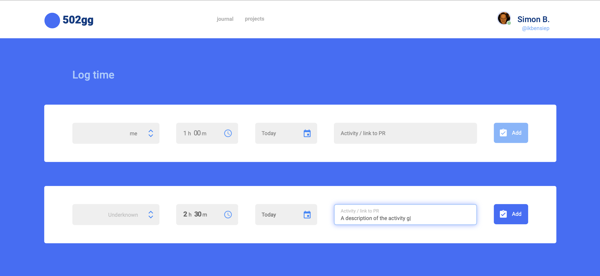
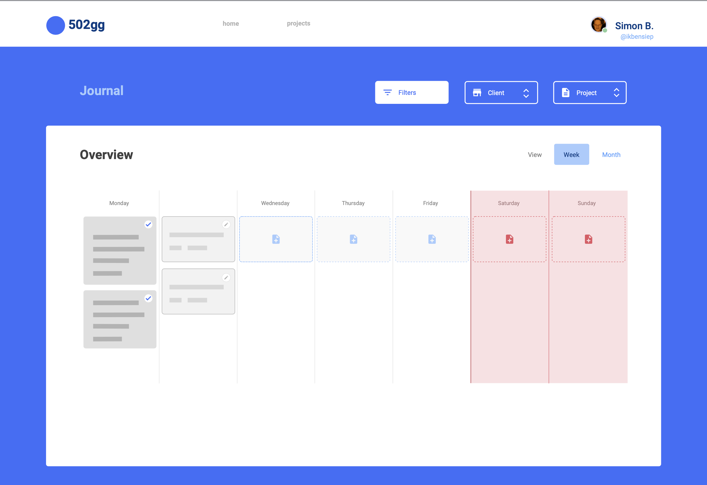
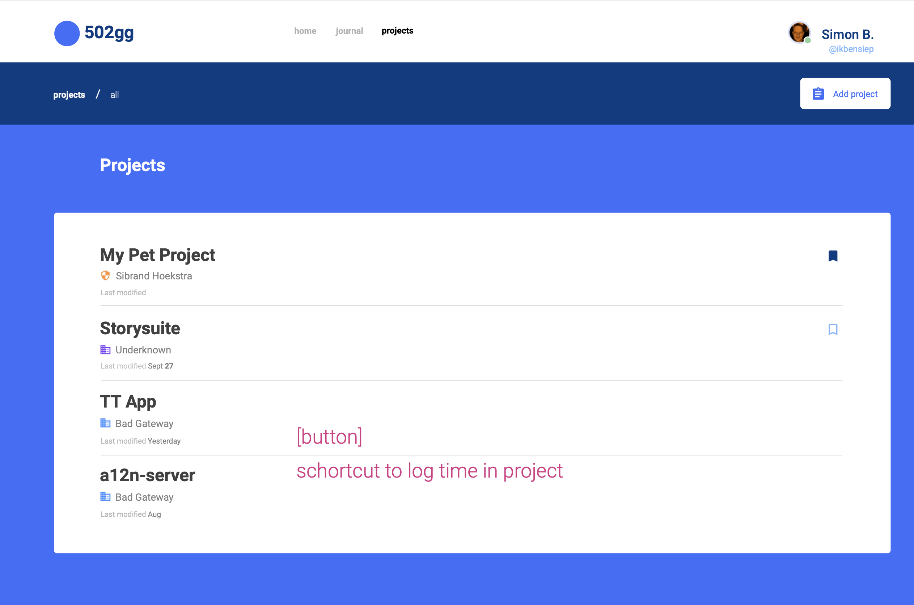
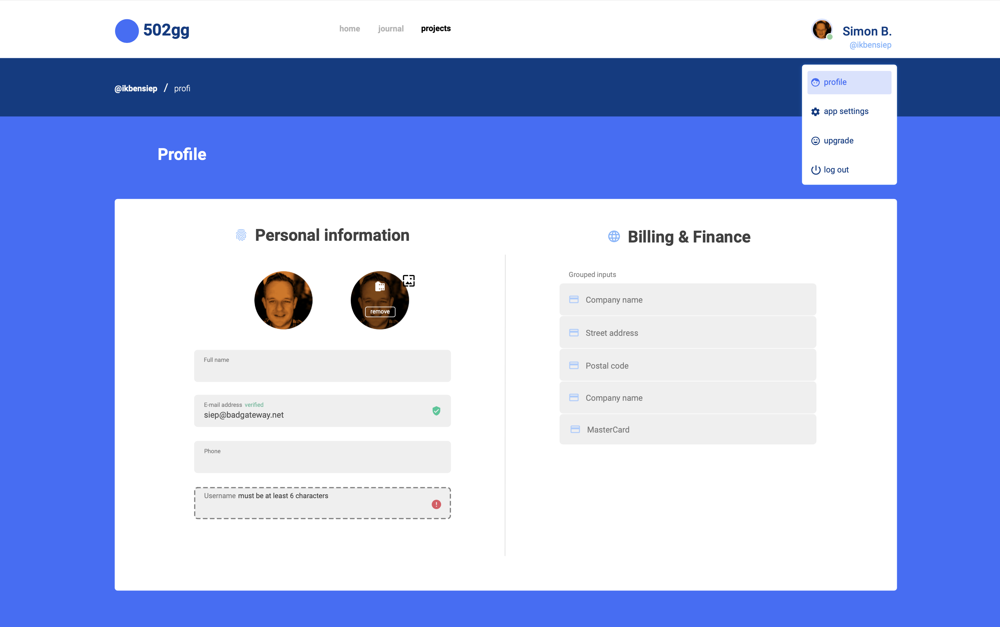

# ⏳ Time Tracking APP ⌛️

A project to track work on projects for clients.

<br>







## 📦 Getting started

### Requirements Overview

The following are required to run this project:

- Node & NPM installed, package dependencies installed `npm i`.
- MySQL database set up and running.
- [Time tracking project API set up and running](https://github.com/formanite-20/time-tracking-webapp#readme).

<br>

### Setting Up The Database

Create a mysql database for this project. We're using "time-tracking-webapp" as an identifier here often, shortform for "time tracking". Set the database user password `your_password` to your own appropriate password.
```
mysql> CREATE DATABASE time-tracking-webapp;
mysql> CREATE USER 'time-tracking-webapp' IDENTIFIED BY 'your_password';
mysql> GRANT SELECT, REFERENCES, INSERT, UPDATE, DELETE, ALTER, CREATE, DROP ON time-tracking-webapp.* TO 'time-tracking-webapp';
mysql> FLUSH PRIVILEGES;
```

<br>

Populate the database using knex, which should add tables automatically.<br>
```
knex --knexfile ./resources/knexfile.ts migrate:latest
```

This should populate your database with the required tables.

<br>

## 👷 Development

### Running

From the root directory, initiate the project with `npm run start` (make sure the deps are installed).<br>
The API server can be browsed at http://localhost:8902/.

### File Structure

To keep all of our component files easy to browse and intuitive to find, this is the general file organization guide:
```
src
├── components
│   ├── reusable component
│   │   ├── (reusable component main)
│   │   └── (reusable component parts)
│   ├── (single reusable component)
│   └── (single reusable component)
├── pages
│   └── page //eg: 'people'
│       ├── sub-page //eg: 'new'
│       │   ├── (page component)
│       │   └── (page unique components)
│       ├── sub-page //eg: 'edit'
│       │   ├── (page component)
│       │   └── (page unique components)
│       ├── (main page component)
│       └── (main page unique components)
├── types
│   └── (reusable custom types)
├── utilities
│   └── (reusable utility functions/variables)
└── app.tsx
```
